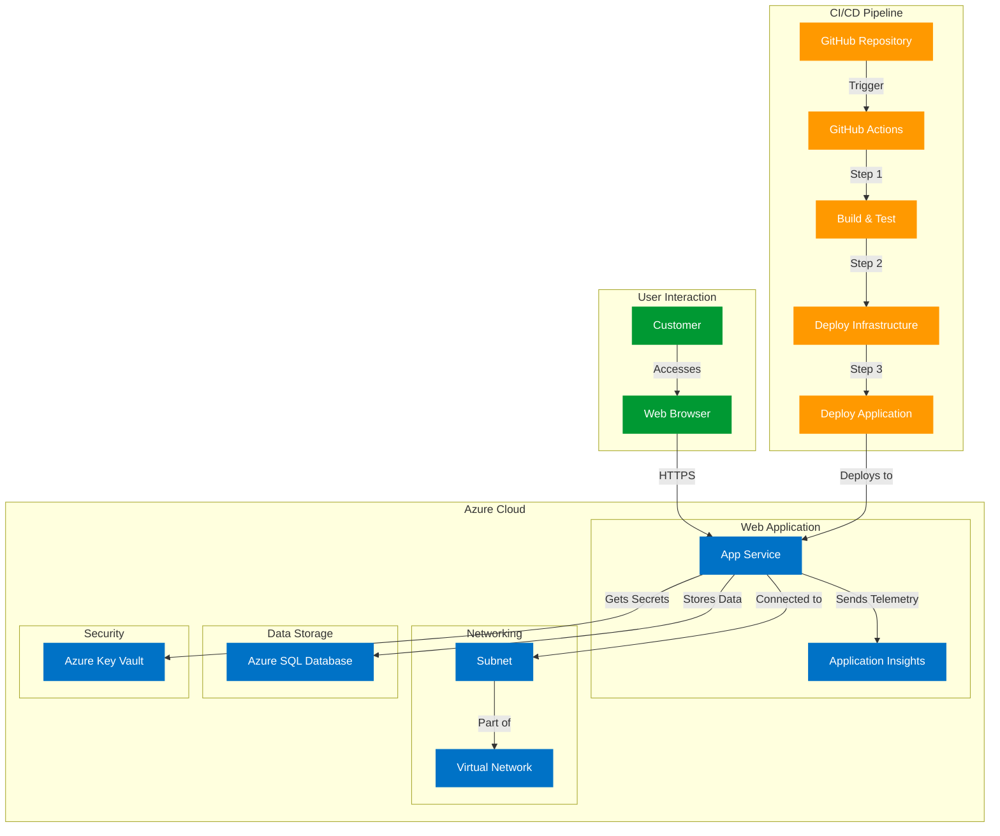

# Amsterdam Coffee Shop - Web Application

A .NET Core web application for a coffee shop in Amsterdam, allowing customers to place coffee orders online with Azure backend services.

## Architecture Overview

This project uses:

- **Frontend**: ASP.NET Core 9 Razor Pages
- **Backend**: .NET Core Web API
- **Database**: Azure SQL Database
- **Security**: Azure Key Vault for secret management
- **Monitoring**: Application Insights
- **Networking**: VNet Integration
- **Infrastructure**: Bicep for Infrastructure as Code
- **CI/CD**: GitHub Actions pipeline

## Architecture Diagram



## CI/CD Pipeline Setup

We've created a detailed setup guide for the CI/CD pipeline. Please refer to the [Setup Guide](docs/setup-guide.md) for step-by-step instructions on:

1. Creating a GitHub repository
2. Setting up your Azure environment
3. Configuring GitHub secrets
4. Deploying the application
5. Troubleshooting common issues

Additional documentation:
- [CI/CD Pipeline Details](docs/cicd-pipeline.md)
- [Image Upload Guide](docs/image-upload-guide.md)

### Pipeline Steps

1. **Build and Test**:
   - Restores NuGet packages
   - Builds the application
   - Runs unit tests
   - Creates a publishable artifact

2. **Deploy Infrastructure**:
   - Deploys Bicep templates to Azure
   - Creates/updates all required Azure resources
   - Gets the deployed web app name

3. **Deploy Application**:
   - Deploys the web application to Azure App Service
   - Applies any database migrations

For more detailed information, see:
- [CI/CD Pipeline Documentation](docs/cicd-pipeline.md)
- [Setup Guide](docs/setup-guide.md)
- [Quick Start Guide for Developers](docs/quickstart.md)

## Adding Images to the Website

To add images to the website:

1. **Local Development**:
   - Place images in the `/wwwroot/images` directory
   - Reference them in your HTML using paths like `/images/your-image.jpg`

2. **Production Deployment**:
   - Add images to the same `/wwwroot/images` directory
   - They will be automatically deployed as part of the CI/CD pipeline

3. **Alternative Method (Azure Storage)**:
   - Upload images to Azure Blob Storage
   - Configure the storage account for static website hosting
   - Create a CDN endpoint for the storage account
   - Reference images using the CDN URL

## Local Development

For detailed instructions on setting up your local development environment, see our [Quick Start Guide for Developers](docs/quickstart.md).

### Requirements

- .NET 9.0 SDK
- A local SQL Server or SQL Server Express
- Git for version control

### Basic Setup

1. Clone the repository
2. Update the connection string in `appsettings.Development.json`
3. Run database migrations: `dotnet ef database update`
4. Run the application:

```powershell
dotnet run --project AmsterdamCoffeeShop
```
