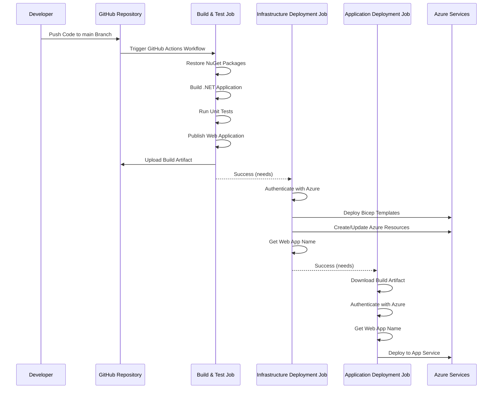

# CI/CD Pipeline Documentation

This document provides detailed information on the CI/CD pipeline for the Amsterdam Coffee Shop web application.

## Pipeline Architecture

The CI/CD pipeline uses GitHub Actions to automate the build, test, and deployment process of the application to Azure. The pipeline is defined in the `.github/workflows/deploy.yml` file.

## Pipeline Flow



## Workflow Details

### Triggers

The workflow is triggered on:
- Push to the `main` branch
- Pull request to the `main` branch
- Manual trigger via workflow_dispatch

### Environment Variables

- `AZURE_RESOURCE_GROUP`: Target Azure resource group
- `PROJECT_NAME`: The name of the project used for resource naming
- `ENVIRONMENT`: Deployment environment (e.g., prod)
- `DOTNET_VERSION`: The .NET SDK version to use
- `WORKING_DIRECTORY`: The directory containing the application code

### Jobs

#### 1. Build and Test

This job builds and tests the application:
- Checks out the code
- Sets up .NET environment
- Restores dependencies
- Builds the application
- Runs tests
- Publishes the application
- Uploads the build artifact

#### 2. Deploy Infrastructure

This job deploys the Azure infrastructure:
- Checks out the code
- Logs in to Azure using the `AZURE_CREDENTIALS` secret
- Deploys the Bicep template to Azure
- Gets the name of the deployed web app

#### 3. Deploy Application

This job deploys the application to Azure:
- Downloads the build artifact
- Logs in to Azure
- Gets the name of the deployed web app
- Deploys the application to Azure App Service

## Required Secrets

The following secrets need to be configured in the GitHub repository:

- `AZURE_CREDENTIALS`: Azure service principal credentials in JSON format
- `SQL_ADMIN_USERNAME`: SQL Server administrator username
- `SQL_ADMIN_PASSWORD`: SQL Server administrator password

## Creating Azure Service Principal

To create the service principal required for the GitHub Actions workflow:

```powershell
# Login to Azure
az login

# Create a service principal with contributor access to the resource group
az ad sp create-for-rbac --name "AmsterdamCoffeeGitHubActions" --role contributor --scopes /subscriptions/{subscription-id}/resourceGroups/amsterdam-coffee-rg --sdk-auth
```

The output will be a JSON object that needs to be stored as the `AZURE_CREDENTIALS` secret in GitHub.

## Setting Up GitHub Secrets

1. Go to your GitHub repository
2. Click on "Settings"
3. Click on "Secrets and variables" > "Actions"
4. Click "New repository secret"
5. Create the required secrets:
   - Name: `AZURE_CREDENTIALS`, Value: [output from service principal creation]
   - Name: `SQL_ADMIN_USERNAME`, Value: [your SQL admin username]
   - Name: `SQL_ADMIN_PASSWORD`, Value: [your SQL admin password]

## Resources Deployed

The following Azure resources are deployed by the Bicep template:

- **App Service Plan**: Hosting plan for the web application (B1 tier)
- **App Service**: The web application itself
- **Virtual Network**: Network infrastructure with subnet for App Service integration
- **Azure SQL Server**: Database server
- **Azure SQL Database**: Database for the application
- **Key Vault**: For storing application secrets
- **Application Insights**: For monitoring and telemetry

## Troubleshooting

### Common Issues

#### 1. Authentication Failures
- Verify the `AZURE_CREDENTIALS` secret is correctly configured
- Ensure the service principal has the required permissions

#### 2. Deployment Failures
- Check the GitHub Actions logs for specific error messages
- Verify the Bicep template syntax
- Check for resource naming conflicts in Azure

#### 3. Application Not Working After Deployment
- Check the App Service logs in Azure Portal
- Verify the connection string is correctly configured
- Check if the Application Insights is properly connected
